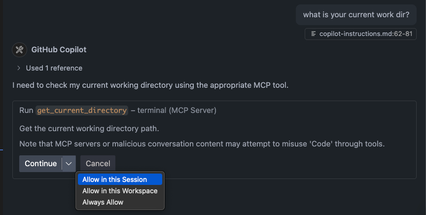

# mcp xterminal



A MCP server that suppose work around Copilot inability to autonomously execute terminal commands.

Initially forked from [stat-guy/terminal](https://github.com/stat-guy/terminal)

`Project is in a prototype stage - using is not advised`

Check PRs for work in progress and `docs/` for iteration stages, work done and  planned.

---

## What it does

Secure MCP server that enables AI agents to execute terminal commands with security controls:

- **Whitelisted commands only** - Blocks dangerous commands (rm, curl, sudo, etc.)
- **Directory boundaries** - Restricts access to specified directories
- **Argument validation** - Prevents command injection attacks
- **MCP protocol compliant** - Works with VS Code Copilot and other MCP clients

## Tools provided

- `execute_command` - Run whitelisted shell commands
- `change_directory` - Navigate within boundary directories
- `get_current_directory` - Get current working directory
- `get_terminal_info` - System and session information
- `list_allowed_commands` - Show all whitelisted commands

## Security features

- 🔒 Command whitelist with 28+ safe commands
- 🔒 Directory traversal protection
- 🔒 Argument count and pattern validation
- 🔒 Configurable boundary directory enforcement
- 🔒 No network access commands allowed

## Key Differences

And they explain why Copilot Agent has no autorun mode.

### **`run_in_terminal`** (VS Code built-in):
- Full shell access with no restrictions
- Can run any command
- Persistent terminal session
- Can run background processes
- Direct shell execution

### **MCP Terminal Tools** (this project):
- Security-restricted command execution
- Whitelisted commands only
- Directory boundary enforcement
- Argument validation
- No dangerous commands allowed

xterminal tools are intented to be the secure alternative to `run_in_terminal` for AI agents.


## Quick start

```bash
npm install
npm run build
```

Configure in VS Code MCP settings:
```json
{
  "mcp": {
    "servers": {
      "terminal": {
        "type": "stdio",
        "command": "node",
        "args": ["~/path/to/mcp-xterminal/dist/index.js"],
        "env": {
          "BOUNDARY_DIR": "/safe/directory/path"
        }
      }
    }
  }
}
```

## Copilot Instructions

By default Copilot will favour to use internal commands.
To help steering agent in the correct direction :) add below to your `copilot-instructions.md`

```
<critical type=terminal_commands>
1. **ONLY** use following tools:
   - `execute_command`
   - `change_directory`
   - `get_current_directory`
   - `get_terminal_info`
   - `list_allowed_commands`
2. **IMPORTANT** INFORM USER IF TOOL DOESN"T SUPPORT YOUR NEEDS FOR THE TASK
3. **IMPORTANT** NEVER BYPASS THE TOOLS, INFORM THE USER OF A PROBLEM
4. **IMPORTANT** TOOLS NOT ALLOWED:
   - `run_in_terminal`
</critical>
```

This stanza is also already [provided](.github/copilot-instructions.md) in the project with other very useful directives for programming. Feel free to copy into your project.

## Contributions

Feel welcome to contribute, add issues or PRs

## License

MIT
